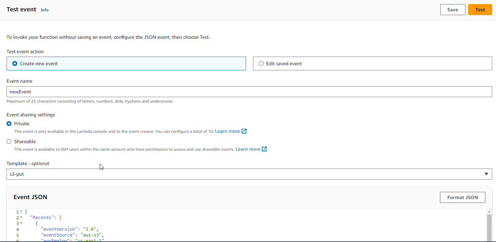
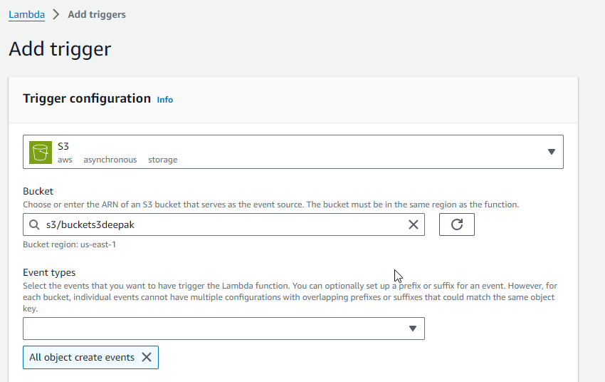

# What is AWS Lambda ?

> AWS Lambda is a serverless compute service that allows you to run code in response to events without needing to manage the underlying infrastructure. With AWS Lambda, you can build applications or services that automatically scale in response to incoming traffic or other triggers, without having to provision or manage servers. For example, each time a user uploads an image to a S3 bucket, it can instantly invoke a Lambda function to generate a thumbnail for that image.

## Practical Tasks:

## Practical Task 1: Activity: AWS Lambda from the Cloud foundation module. 
## Practical Task 2: AWS Lambda - Retrieving the metadata of a file that is uploaded in S3 bucket.

In this task, you will utilize AWS Lambda to process files immediately after they're uploaded to services like Amazon S3.Whenever a user uploads an image to the S3 bucket, it should trigger a lambda function that processes the file and logs its metadata to Amazon CloudWatch Logs.

***You are required to follow the following steps to complete the lab***. 

### Step 1: Set Up an S3 Bucket:
1. Go to the S3 Console and create an S3 bucket to upload files. (General Purpose, ACLs disabled, Block Public Access Settings for this bucket, Bucket Versioning: Disabled)


### Step 2:  Create a Lambda Function and select Python 3.11 as run time. In the execution role, use an existing role (LabRole). Use the following source code for the lambda function. Save and deploy the function.

***Code for the function***
```
import json
import boto3
print('Loading function')
s3 = boto3.client('s3')

def lambda_handler(event, context):
    # Retrieve the bucket and object key from the S3 event
    bucket = event['Records'][0]['s3']['bucket']['name']
    object_key = event['Records'][0]['s3']['object']['key']

    try:
        # Get the metadata of the S3 object
        response = s3.head_object(Bucket=bucket, Key=object_key)

        # Extract relevant metadata attributes
        metadata = {
            "Content-Type": response['ContentType'],
            "Content-Length": response['ContentLength'],
            "Last-Modified": response['LastModified'].strftime("%Y-%m-%d %H:%M:%S"),
            # Add more metadata attributes as needed
        }

        # Print the metadata to CloudWatch Logs
        print("Object Metadata:")
        print(json.dumps(metadata, indent=2))

        return {
            'statusCode': 200,
            'body': json.dumps(metadata)
        }
    except Exception as e:
        print(f"Error: {str(e)}")
        return {
            'statusCode': 500,
            'body': 'Error retrieving metadata'
        }

```
### Step 4: Upload a file to the S3 bucket your created earlier


### Step 5: Update the test case and check your function is working as it should. 

1. **Create a test event** in the AWS Lambda Console as in the image below.
2. **Update the bucket name** and image file name in the event to match what exists in your S3 bucket.
3. Click **Test** to run the function.
4. You can now **deploy the function**.



### Step 6: Create a trigger so that every time you upload a file to the S3 bucket, it should get the meta info in the logs. 



### Step 7: Go to CloudWatch >> Logs >> Log Groups >> From the list of log, select the log of your function and ensure that you in the log you can see the metadata of the upload files. 


## Challenge: Automating EBS Snapshot Creation 

In this task, you will create a Lambda Function that runs Python code to create EBS snapshots according to the schedule.  

**Note: After completing the tasks, make sure to terminate/delete your resources to avoid unnecessary costs.** 

### Read More
- [AWS Lambda - Developer Guide](https://docs.aws.amazon.com/lambda/latest/dg/welcome.html)
- [Tutorial: Using an Amazon S3 trigger to create thumbnail images](https://docs.aws.amazon.com/lambda/latest/dg/with-s3-example.html)
- [Tutorial: Using an Amazon S3 trigger to invoke a Lambda function](https://docs.aws.amazon.com/lambda/latest/dg/with-s3-tutorial.html)